# Part 1. Настройка gitlab-runner

### Поднять виртуальную машину Ubuntu Server 22.04 LTS

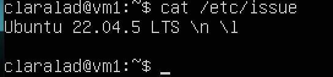

### Скачать и установить на виртуальную машину gitlab-runner


`curl -L https://packages.gitlab.com/install/repositories/runner/gitlab-ci-multi-runner/script.deb.sh | sudo bash`

`sudo curl -L --output /usr/local/bin/gitlab-runner "https://gitlab-runner-downloads.s3.amazonaws.com/latest/binaries/gitlab-runner-linux-amd64"`

`apt install gitlab-runner`

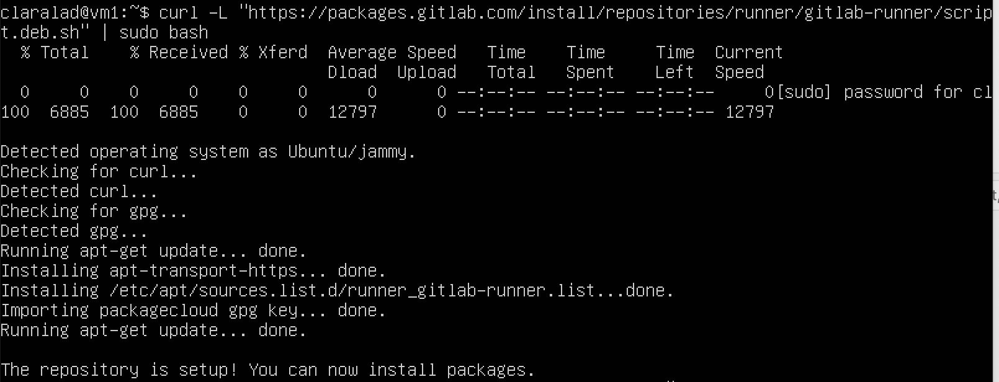

### Запусти gitlab-runner и зарегистрируй его для использования в текущем проекте (DO6_CICD).

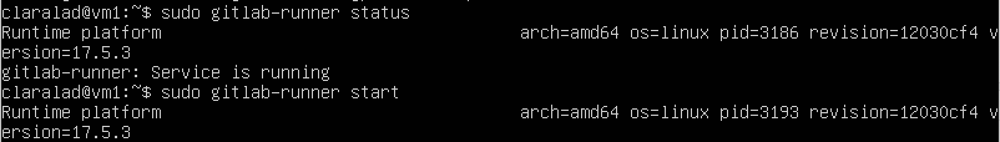

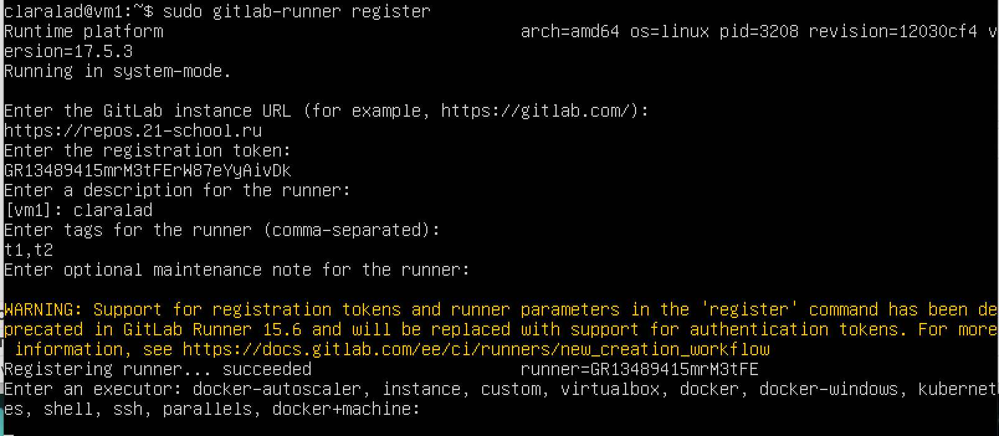

# Part 2. Сборка

## Написать этап для CI по сборке приложений из проекта C2_SimpleBashScripts

В файле gitlab-ci.yml добавить этап запуска сборки через мейк файл из проекта C2

Файлы, полученные после сборки (артефакты), сохрани в произвольную директорию со сроком хранения 30 дней.

`sudo apt install make`

`sudo apt install gcc`

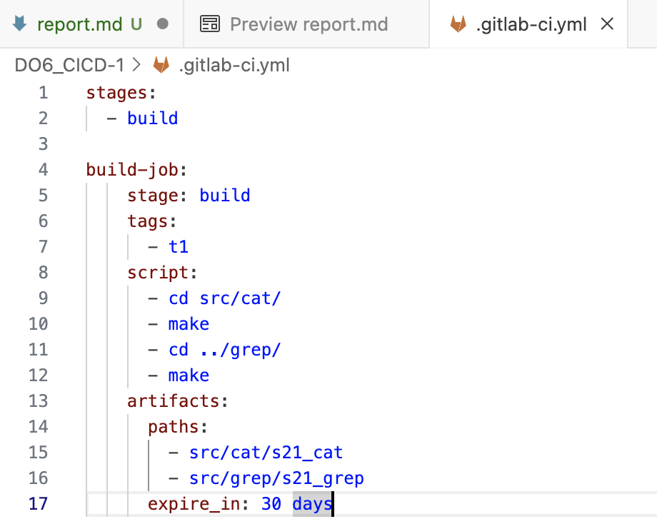

Пайплайн:

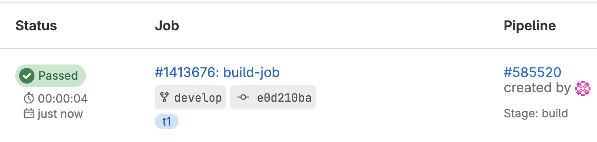

# Part 3. Тест кодстайла

## Написать этап для CI, который запускает скрипт кодстайла (clang-format)

Если кодстайл не прошел, то "зафейлить" пайплайн

В пайплайне отобразить вывод утилиты clang-format

`sudo apt install clang-format`

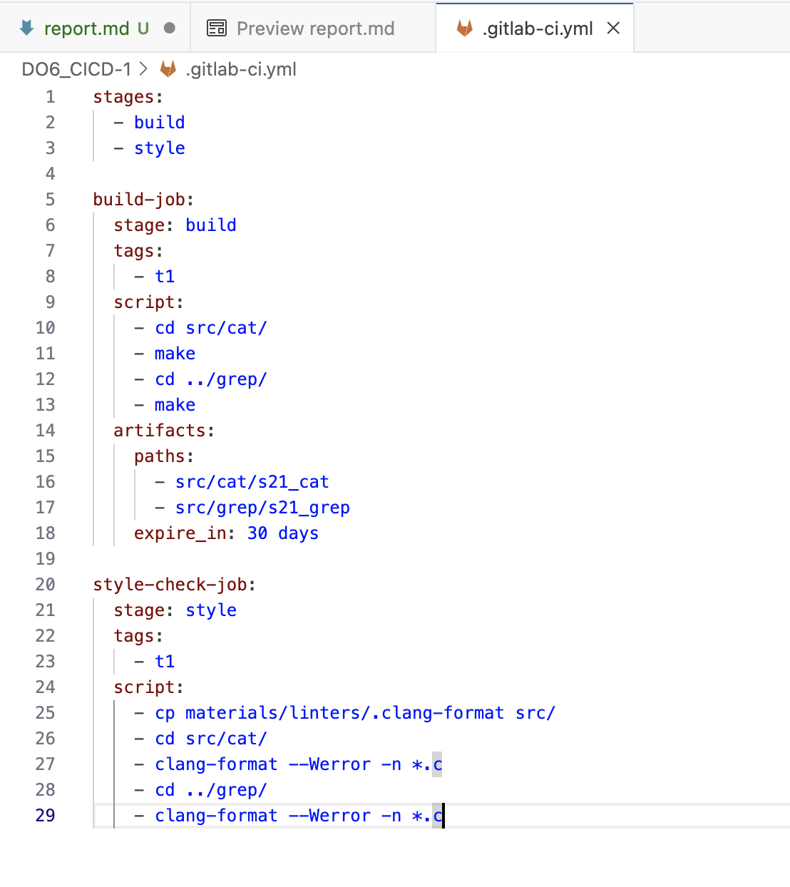

Пайплайн:

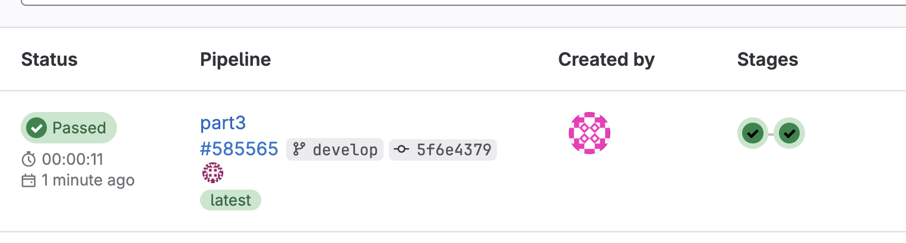

# Part 4. Интеграционные тесты

## Напиши этап для CI, который запускает твои интеграционные тесты из того же проекта.

Запусти этот этап автоматически только при условии, если сборка и тест кодстайла прошли успешно.

Если тесты не прошли, то «зафейли» пайплайн.

В пайплайне отобрази вывод, что интеграционные тесты успешно прошли / провалились.

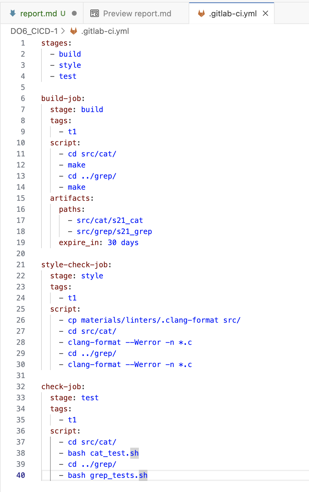

Пайплайн с провалившимися тестами:

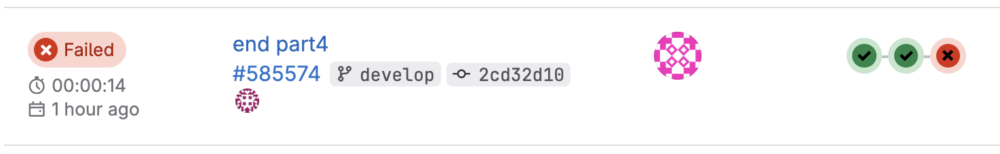

Пайплайн с прохождением тестов:

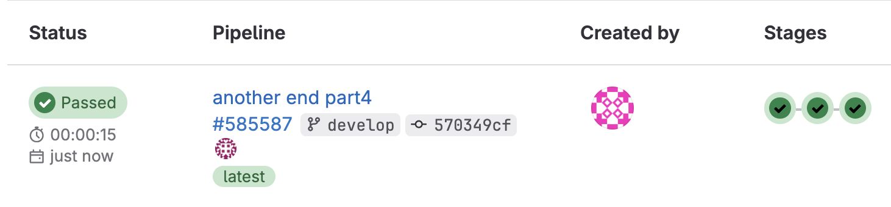

# Part 5. Этап деплоя

Подними вторую виртуальную машину Ubuntu Server 22.04 LTS.

### Напиши этап для CD, который «разворачивает» проект на другой виртуальной машине.

Запусти этот этап вручную при условии, что все предыдущие этапы прошли успешно.

Напиши bash-скрипт, который при помощи ssh и scp копирует файлы, полученные после сборки (артефакты), в директорию /usr/local/bin второй виртуальной машины.

В файле gitlab-ci.yml добавь этап запуска написанного скрипта.

В случае ошибки «зафейли» пайплайн.

`Сначала нужно установить связать две виртуальные машины между собой как делали в DO2_LinuxNetwork`

```shell
sudo su gitlab-runner

ssh-keygen

ssh-copy-id claralad@10.0.2.254
```

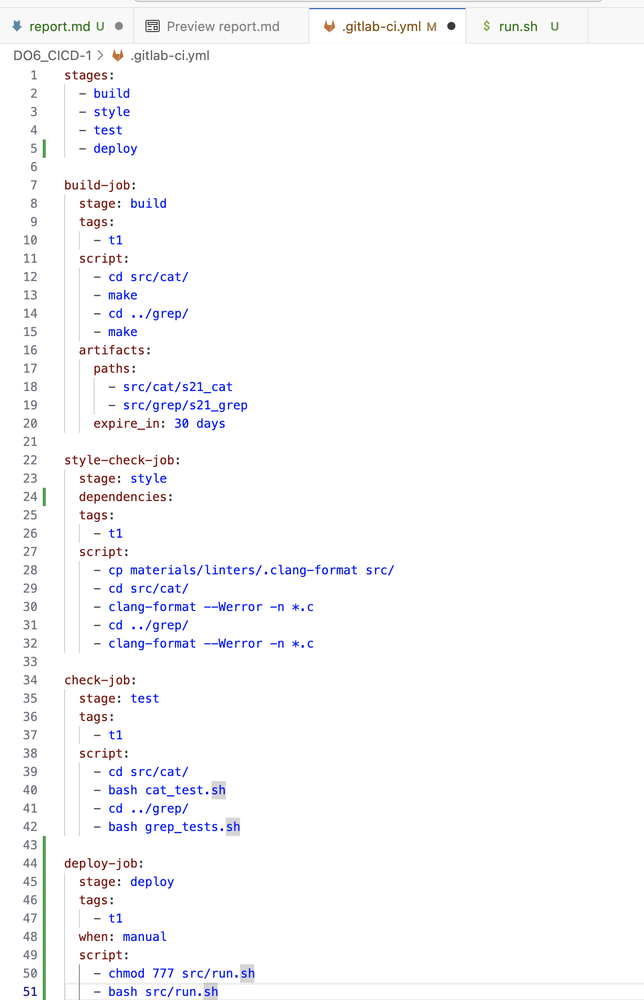

на vm2:

`sudo chown -R claralad /usr/local/bin`

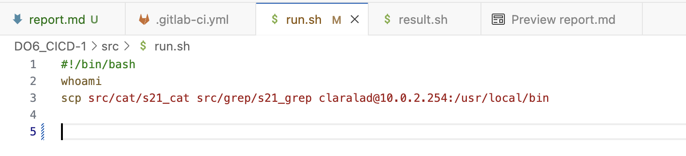

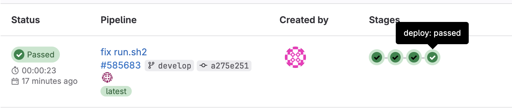

# Part 6. Дополнительно. Уведомления

Настрой уведомления об успешном/неуспешном выполнении пайплайна через бота с именем «[твой nickname] DO6 CI/CD» в Telegram.

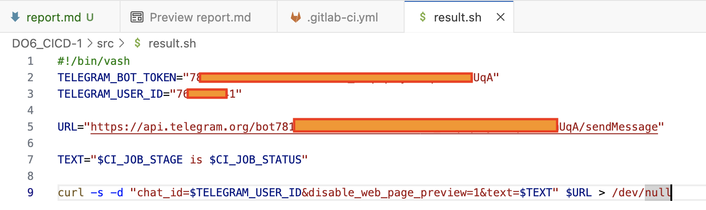

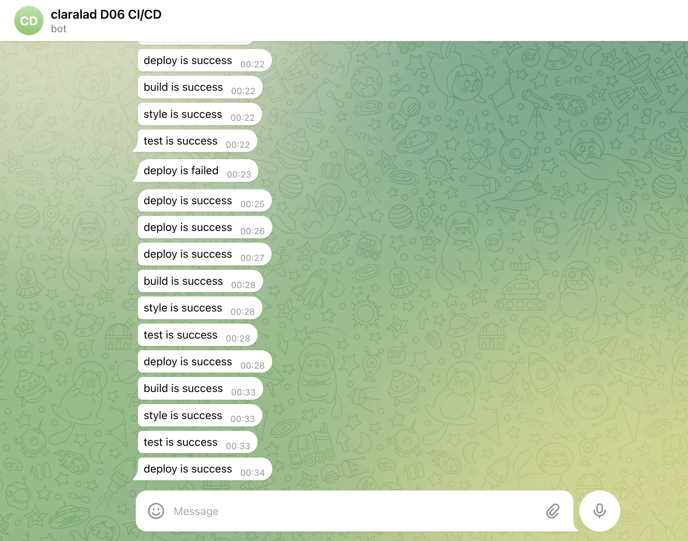
